# Claude-Ready Cartoon Asset Bible

## Read This First

This folder is the complete Claude-ready visual package. Every character, monster, boss, weapon, companion, and world is stored as a separate WebP file. This Markdown file links each image to its technical information. `asset_manifest.json` contains the same information in machine-readable form.

Do not add every concept blindly. Audit the current Godot project, preserve stable IDs and saves, propose a coherent selection, and implement one approved content group at a time.

## Locked Style

- Original culturally neutral fantasy cartoon style.
- Bold outlines, rounded shapes, flat colors, two-step cel shading.
- No Arabic or Middle Eastern motifs.
- No copied Tap Titans or protected franchise art.
- Portrait mobile layout and small-screen readability are mandatory.

## Package Counts

- All Non World Assets: **116**
- Characters: **20**
- Monsters: **39**
- Bosses: **13**
- Weapons: **31**
- Companions: **13**
- Worlds: **10**

# Characters

### `main_hero` - Main Hero

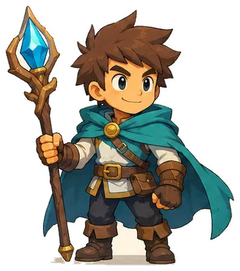

- Category: `character`
- Role / affinity: Primary tap hero
- Visual form: Balanced adventurer with crystal staff and teal cape.
- Extracted reference size: `396x448`
- Recommended display height at 1080x1920: `300-360 px`; max source texture: `512 px`.
- Anchor: `bottom_center`
- Animation plan: idle(4), attack(6), critical_attack(6), hit(3), victory(5)
- Source sheet: `assets/reference_sheets/base.webp`; index `1`
- Status: concept reference. Claude must clean or redraw it before production use.

### `core_knight` - Core Knight

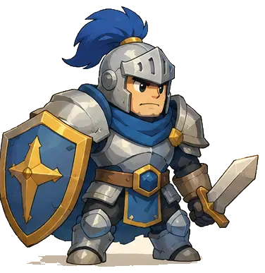

- Category: `character`
- Role / affinity: Tank support hero
- Visual form: Compact armored silhouette, sword and shield.
- Extracted reference size: `376x387`
- Recommended display height at 1080x1920: `300-360 px`; max source texture: `512 px`.
- Anchor: `bottom_center`
- Animation plan: idle(4), attack(6), critical_attack(6), hit(3), victory(5)
- Source sheet: `assets/reference_sheets/base.webp`; index `3`
- Status: concept reference. Claude must clean or redraw it before production use.

### `core_archer` - Core Archer

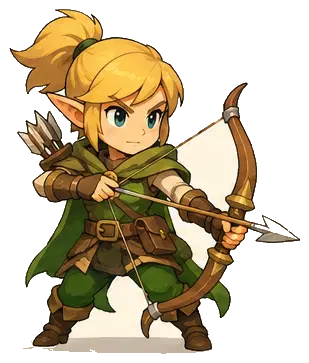

- Category: `character`
- Role / affinity: Ranged support hero
- Visual form: Fast bow user with clear side-facing attack pose.
- Extracted reference size: `309x363`
- Recommended display height at 1080x1920: `300-360 px`; max source texture: `512 px`.
- Anchor: `bottom_center`
- Animation plan: idle(4), attack(6), critical_attack(6), hit(3), victory(5)
- Source sheet: `assets/reference_sheets/base.webp`; index `4`
- Status: concept reference. Claude must clean or redraw it before production use.

### `core_mage` - Core Mage

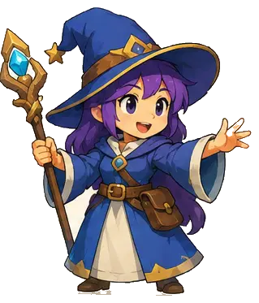

- Category: `character`
- Role / affinity: Magic support hero
- Visual form: Blue and purple caster with staff and wide hat.
- Extracted reference size: `319x373`
- Recommended display height at 1080x1920: `300-360 px`; max source texture: `512 px`.
- Anchor: `bottom_center`
- Animation plan: idle(4), attack(6), critical_attack(6), hit(3), victory(5)
- Source sheet: `assets/reference_sheets/base.webp`; index `5`
- Status: concept reference. Claude must clean or redraw it before production use.

### `ember_duelist` - Ember Duelist

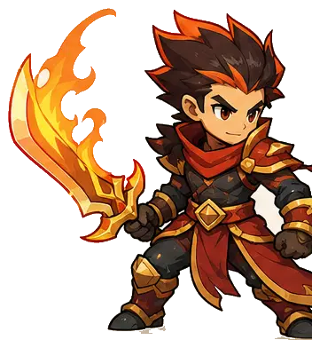

- Category: `character`
- Role / affinity: Melee fire hero
- Visual form: Aggressive sword silhouette and burst tap-damage identity.
- Extracted reference size: `352x392`
- Recommended display height at 1080x1920: `300-360 px`; max source texture: `512 px`.
- Anchor: `bottom_center`
- Animation plan: idle(4), attack(6), critical_attack(6), hit(3), victory(5)
- Source sheet: `assets/reference_sheets/hero_a.webp`; index `1`
- Status: concept reference. Claude must clean or redraw it before production use.

### `frost_ranger` - Frost Ranger

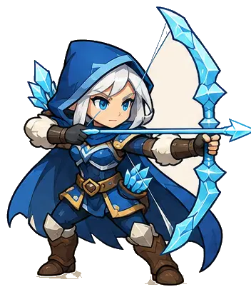

- Category: `character`
- Role / affinity: Ranged control hero
- Visual form: Ice bow; slow or freeze visual identity.
- Extracted reference size: `352x409`
- Recommended display height at 1080x1920: `300-360 px`; max source texture: `512 px`.
- Anchor: `bottom_center`
- Animation plan: idle(4), attack(6), critical_attack(6), hit(3), victory(5)
- Source sheet: `assets/reference_sheets/hero_a.webp`; index `2`
- Status: concept reference. Claude must clean or redraw it before production use.

### `storm_paladin` - Storm Paladin

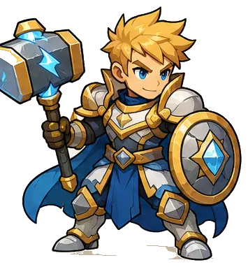

- Category: `character`
- Role / affinity: Tank and stun hero
- Visual form: Hammer and round shield; heavy impact silhouette.
- Extracted reference size: `355x382`
- Recommended display height at 1080x1920: `300-360 px`; max source texture: `512 px`.
- Anchor: `bottom_center`
- Animation plan: idle(4), attack(6), critical_attack(6), hit(3), victory(5)
- Source sheet: `assets/reference_sheets/hero_a.webp`; index `3`
- Status: concept reference. Claude must clean or redraw it before production use.

### `grove_druid` - Grove Druid

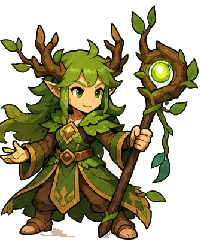

- Category: `character`
- Role / affinity: Support healer
- Visual form: Branch staff, leaf cloak, and nature aura.
- Extracted reference size: `341x409`
- Recommended display height at 1080x1920: `300-360 px`; max source texture: `512 px`.
- Anchor: `bottom_center`
- Animation plan: idle(4), attack(6), critical_attack(6), hit(3), victory(5)
- Source sheet: `assets/reference_sheets/hero_a.webp`; index `4`
- Status: concept reference. Claude must clean or redraw it before production use.

### `crystal_monk` - Crystal Monk

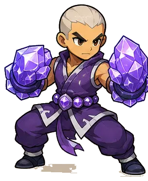

- Category: `character`
- Role / affinity: Critical melee hero
- Visual form: Large crystal gauntlets; short-range rapid attacks.
- Extracted reference size: `305x372`
- Recommended display height at 1080x1920: `300-360 px`; max source texture: `512 px`.
- Anchor: `bottom_center`
- Animation plan: idle(4), attack(6), critical_attack(6), hit(3), victory(5)
- Source sheet: `assets/reference_sheets/hero_a.webp`; index `5`
- Status: concept reference. Claude must clean or redraw it before production use.

### `shadow_rogue` - Shadow Rogue

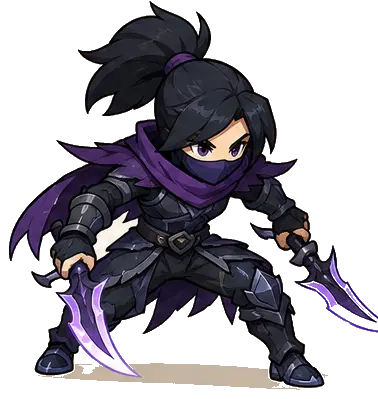

- Category: `character`
- Role / affinity: Attack-speed hero
- Visual form: Twin daggers and low agile stance.
- Extracted reference size: `378x399`
- Recommended display height at 1080x1920: `300-360 px`; max source texture: `512 px`.
- Anchor: `bottom_center`
- Animation plan: idle(4), attack(6), critical_attack(6), hit(3), victory(5)
- Source sheet: `assets/reference_sheets/hero_a.webp`; index `6`
- Status: concept reference. Claude must clean or redraw it before production use.

### `sky_lancer` - Sky Lancer

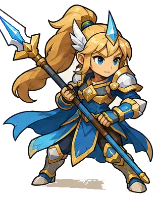

- Category: `character`
- Role / affinity: Piercing melee hero
- Visual form: Long spear and strong forward attack line.
- Extracted reference size: `313x393`
- Recommended display height at 1080x1920: `300-360 px`; max source texture: `512 px`.
- Anchor: `bottom_center`
- Animation plan: idle(4), attack(6), critical_attack(6), hit(3), victory(5)
- Source sheet: `assets/reference_sheets/hero_a.webp`; index `7`
- Status: concept reference. Claude must clean or redraw it before production use.

### `arcane_alchemist` - Arcane Alchemist

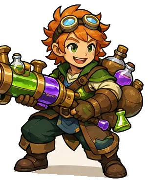

- Category: `character`
- Role / affinity: Ranged debuff hero
- Visual form: Potion launcher and status-effect identity.
- Extracted reference size: `303x374`
- Recommended display height at 1080x1920: `300-360 px`; max source texture: `512 px`.
- Anchor: `bottom_center`
- Animation plan: idle(4), attack(6), critical_attack(6), hit(3), victory(5)
- Source sheet: `assets/reference_sheets/hero_a.webp`; index `8`
- Status: concept reference. Claude must clean or redraw it before production use.

### `iron_engineer` - Iron Engineer

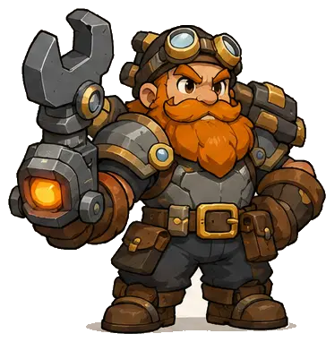

- Category: `character`
- Role / affinity: Ranged device hero
- Visual form: Mechanical cannon-wrench and deployable gadget identity.
- Extracted reference size: `364x382`
- Recommended display height at 1080x1920: `300-360 px`; max source texture: `512 px`.
- Anchor: `bottom_center`
- Animation plan: idle(4), attack(6), critical_attack(6), hit(3), victory(5)
- Source sheet: `assets/reference_sheets/hero_b.webp`; index `1`
- Status: concept reference. Claude must clean or redraw it before production use.

### `moon_bard` - Moon Bard

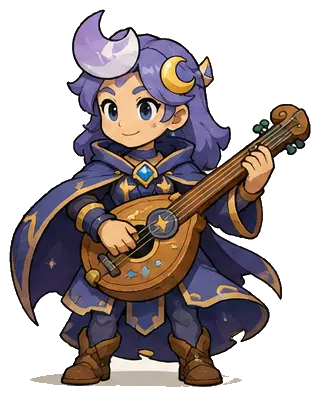

- Category: `character`
- Role / affinity: Skill-duration support
- Visual form: Magical lute and moon-themed buffs.
- Extracted reference size: `320x396`
- Recommended display height at 1080x1920: `300-360 px`; max source texture: `512 px`.
- Anchor: `bottom_center`
- Animation plan: idle(4), attack(6), critical_attack(6), hit(3), victory(5)
- Source sheet: `assets/reference_sheets/hero_b.webp`; index `2`
- Status: concept reference. Claude must clean or redraw it before production use.

### `spirit_tamer` - Spirit Tamer

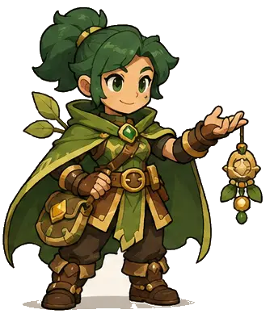

- Category: `character`
- Role / affinity: Companion support
- Visual form: Floating spirit and summon-focused bonuses.
- Extracted reference size: `334x394`
- Recommended display height at 1080x1920: `300-360 px`; max source texture: `512 px`.
- Anchor: `bottom_center`
- Animation plan: idle(4), attack(6), critical_attack(6), hit(3), victory(5)
- Source sheet: `assets/reference_sheets/hero_b.webp`; index `3`
- Status: concept reference. Claude must clean or redraw it before production use.

### `sun_cleric` - Sun Cleric

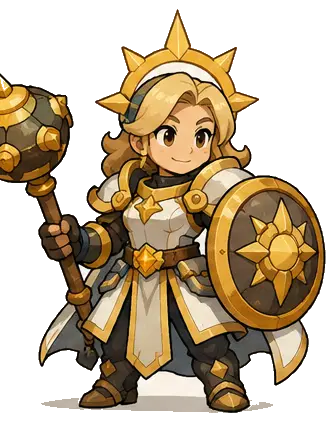

- Category: `character`
- Role / affinity: Defensive support
- Visual form: Mace and sun shield; healing and protection.
- Extracted reference size: `335x422`
- Recommended display height at 1080x1920: `300-360 px`; max source texture: `512 px`.
- Anchor: `bottom_center`
- Animation plan: idle(4), attack(6), critical_attack(6), hit(3), victory(5)
- Source sheet: `assets/reference_sheets/hero_b.webp`; index `4`
- Status: concept reference. Claude must clean or redraw it before production use.

### `wild_beast_rider` - Wild Beast Rider

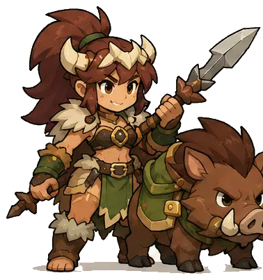

- Category: `character`
- Role / affinity: Summon melee hero
- Visual form: Boar partner and charge-based attack.
- Extracted reference size: `378x403`
- Recommended display height at 1080x1920: `300-360 px`; max source texture: `512 px`.
- Anchor: `bottom_center`
- Animation plan: idle(4), attack(6), critical_attack(6), hit(3), victory(5)
- Source sheet: `assets/reference_sheets/hero_b.webp`; index `5`
- Status: concept reference. Claude must clean or redraw it before production use.

### `rune_scholar` - Rune Scholar

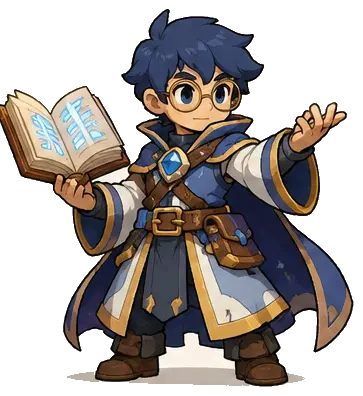

- Category: `character`
- Role / affinity: Magic damage hero
- Visual form: Open spellbook and floating rune crystal.
- Extracted reference size: `363x396`
- Recommended display height at 1080x1920: `300-360 px`; max source texture: `512 px`.
- Anchor: `bottom_center`
- Animation plan: idle(4), attack(6), critical_attack(6), hit(3), victory(5)
- Source sheet: `assets/reference_sheets/hero_b.webp`; index `6`
- Status: concept reference. Claude must clean or redraw it before production use.

### `wind_dancer` - Wind Dancer

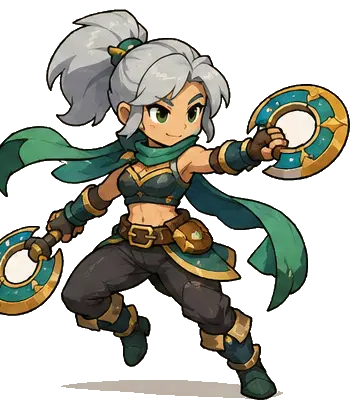

- Category: `character`
- Role / affinity: Agile melee hero
- Visual form: Twin ring blades and dodge-speed identity.
- Extracted reference size: `359x409`
- Recommended display height at 1080x1920: `300-360 px`; max source texture: `512 px`.
- Anchor: `bottom_center`
- Animation plan: idle(4), attack(6), critical_attack(6), hit(3), victory(5)
- Source sheet: `assets/reference_sheets/hero_b.webp`; index `7`
- Status: concept reference. Claude must clean or redraw it before production use.

### `royal_guardian` - Royal Guardian

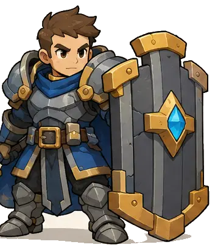

- Category: `character`
- Role / affinity: Heavy tank hero
- Visual form: Oversized tower shield and defensive milestones.
- Extracted reference size: `353x411`
- Recommended display height at 1080x1920: `300-360 px`; max source texture: `512 px`.
- Anchor: `bottom_center`
- Animation plan: idle(4), attack(6), critical_attack(6), hit(3), victory(5)
- Source sheet: `assets/reference_sheets/hero_b.webp`; index `8`
- Status: concept reference. Claude must clean or redraw it before production use.


# Regular Monsters

### `meadow_slime` - Meadow Slime

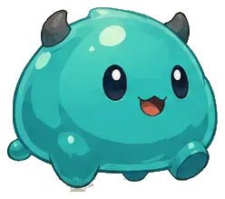

- Category: `monster`
- Role / affinity: Early regular enemy
- Visual form: Round low silhouette; squash-and-stretch hit reaction.
- Extracted reference size: `248x219`
- Recommended display height at 1080x1920: `210-300 px`; max source texture: `512 px`.
- Anchor: `bottom_center`
- Animation plan: idle(4), attack(5), hit(3), defeat(6)
- Source sheet: `assets/reference_sheets/base.webp`; index `6`
- Status: concept reference. Claude must clean or redraw it before production use.

### `forest_horn_beast` - Forest Horn Beast

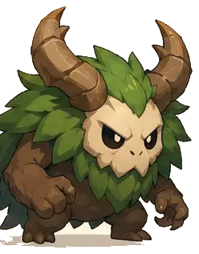

- Category: `monster`
- Role / affinity: Forest regular enemy
- Visual form: Wide horned woodland creature with leafy body.
- Extracted reference size: `248x316`
- Recommended display height at 1080x1920: `210-300 px`; max source texture: `512 px`.
- Anchor: `bottom_center`
- Animation plan: idle(4), attack(5), hit(3), defeat(6)
- Source sheet: `assets/reference_sheets/base.webp`; index `7`
- Status: concept reference. Claude must clean or redraw it before production use.

### `armored_goblin` - Armored Goblin

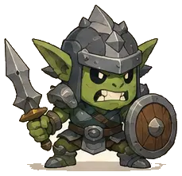

- Category: `monster`
- Role / affinity: Armored regular enemy
- Visual form: Small shield fighter with squat readable silhouette.
- Extracted reference size: `229x221`
- Recommended display height at 1080x1920: `210-300 px`; max source texture: `512 px`.
- Anchor: `bottom_center`
- Animation plan: idle(4), attack(5), hit(3), defeat(6)
- Source sheet: `assets/reference_sheets/base.webp`; index `8`
- Status: concept reference. Claude must clean or redraw it before production use.

### `honey_slime` - Honey Slime

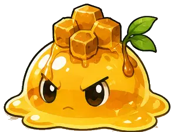

- Category: `monster`
- Role / affinity: Emerald Meadow
- Visual form: Low round slime with sticky bounce attack.
- Extracted reference size: `296x225`
- Recommended display height at 1080x1920: `210-300 px`; max source texture: `512 px`.
- Anchor: `bottom_center`
- Animation plan: idle(4), attack(5), hit(3), defeat(6)
- Source sheet: `assets/reference_sheets/monster_a.webp`; index `1`
- Status: concept reference. Claude must clean or redraw it before production use.

### `sproutling` - Sproutling

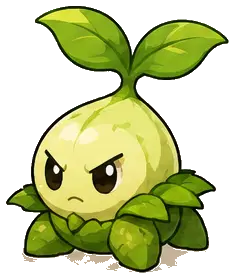

- Category: `monster`
- Role / affinity: Emerald Meadow
- Visual form: Small plant enemy with leaf-top silhouette.
- Extracted reference size: `235x274`
- Recommended display height at 1080x1920: `210-300 px`; max source texture: `512 px`.
- Anchor: `bottom_center`
- Animation plan: idle(4), attack(5), hit(3), defeat(6)
- Source sheet: `assets/reference_sheets/monster_a.webp`; index `2`
- Status: concept reference. Claude must clean or redraw it before production use.

### `pebble_crab` - Pebble Crab

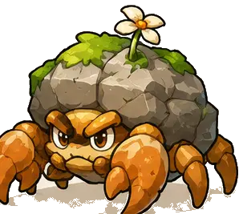

- Category: `monster`
- Role / affinity: Emerald Meadow
- Visual form: Rock shell crab with side-step attack.
- Extracted reference size: `303x267`
- Recommended display height at 1080x1920: `210-300 px`; max source texture: `512 px`.
- Anchor: `bottom_center`
- Animation plan: idle(4), attack(5), hit(3), defeat(6)
- Source sheet: `assets/reference_sheets/monster_a.webp`; index `3`
- Status: concept reference. Claude must clean or redraw it before production use.

### `leaf_fox` - Leaf Fox

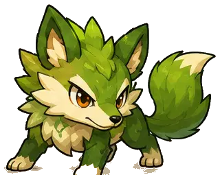

- Category: `monster`
- Role / affinity: Emerald Meadow
- Visual form: Fast woodland runner with pointed silhouette.
- Extracted reference size: `320x255`
- Recommended display height at 1080x1920: `210-300 px`; max source texture: `512 px`.
- Anchor: `bottom_center`
- Animation plan: idle(4), attack(5), hit(3), defeat(6)
- Source sheet: `assets/reference_sheets/monster_a.webp`; index `4`
- Status: concept reference. Claude must clean or redraw it before production use.

### `mushroom_guard` - Mushroom Guard

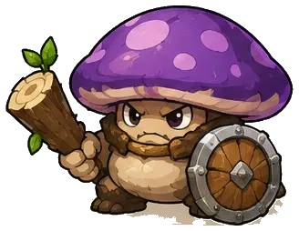

- Category: `monster`
- Role / affinity: Moonlit Wildwood
- Visual form: Shield-and-club mushroom fighter.
- Extracted reference size: `328x254`
- Recommended display height at 1080x1920: `210-300 px`; max source texture: `512 px`.
- Anchor: `bottom_center`
- Animation plan: idle(4), attack(5), hit(3), defeat(6)
- Source sheet: `assets/reference_sheets/monster_a.webp`; index `5`
- Status: concept reference. Claude must clean or redraw it before production use.

### `vine_snapper` - Vine Snapper

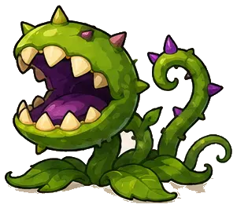

- Category: `monster`
- Role / affinity: Moonlit Wildwood
- Visual form: Stationary plant mouth with snapping attack.
- Extracted reference size: `301x265`
- Recommended display height at 1080x1920: `210-300 px`; max source texture: `512 px`.
- Anchor: `bottom_center`
- Animation plan: idle(4), attack(5), hit(3), defeat(6)
- Source sheet: `assets/reference_sheets/monster_a.webp`; index `6`
- Status: concept reference. Claude must clean or redraw it before production use.

### `crystal_mite` - Crystal Mite

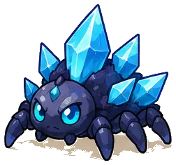

- Category: `monster`
- Role / affinity: Crystal Caverns
- Visual form: Low armored insect carrying bright crystals.
- Extracted reference size: `252x235`
- Recommended display height at 1080x1920: `210-300 px`; max source texture: `512 px`.
- Anchor: `bottom_center`
- Animation plan: idle(4), attack(5), hit(3), defeat(6)
- Source sheet: `assets/reference_sheets/monster_a.webp`; index `7`
- Status: concept reference. Claude must clean or redraw it before production use.

### `puddle_blob` - Puddle Blob

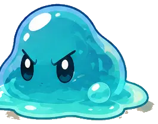

- Category: `monster`
- Role / affinity: Coral Sky Coast
- Visual form: Water slime with splash hit reaction.
- Extracted reference size: `265x207`
- Recommended display height at 1080x1920: `210-300 px`; max source texture: `512 px`.
- Anchor: `bottom_center`
- Animation plan: idle(4), attack(5), hit(3), defeat(6)
- Source sheet: `assets/reference_sheets/monster_a.webp`; index `8`
- Status: concept reference. Claude must clean or redraw it before production use.

### `acorn_brute` - Acorn Brute

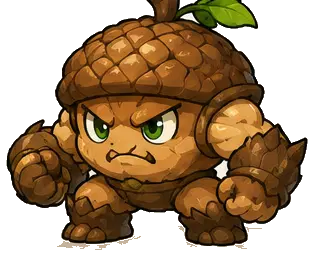

- Category: `monster`
- Role / affinity: Emerald Meadow
- Visual form: Broad fists and acorn-shell armor.
- Extracted reference size: `314x256`
- Recommended display height at 1080x1920: `210-300 px`; max source texture: `512 px`.
- Anchor: `bottom_center`
- Animation plan: idle(4), attack(5), hit(3), defeat(6)
- Source sheet: `assets/reference_sheets/monster_a.webp`; index `9`
- Status: concept reference. Claude must clean or redraw it before production use.

### `moss_turtle` - Moss Turtle

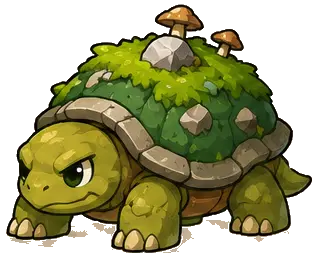

- Category: `monster`
- Role / affinity: Whispering Marsh
- Visual form: Slow defensive enemy with high durability.
- Extracted reference size: `318x259`
- Recommended display height at 1080x1920: `210-300 px`; max source texture: `512 px`.
- Anchor: `bottom_center`
- Animation plan: idle(4), attack(5), hit(3), defeat(6)
- Source sheet: `assets/reference_sheets/monster_a.webp`; index `10`
- Status: concept reference. Claude must clean or redraw it before production use.

### `pollen_wisp` - Pollen Wisp

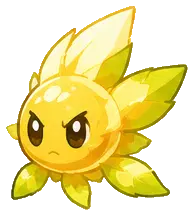

- Category: `monster`
- Role / affinity: Emerald Meadow
- Visual form: Small flying light enemy.
- Extracted reference size: `194x216`
- Recommended display height at 1080x1920: `210-300 px`; max source texture: `512 px`.
- Anchor: `bottom_center`
- Animation plan: idle(4), attack(5), hit(3), defeat(6)
- Source sheet: `assets/reference_sheets/monster_a.webp`; index `11`
- Status: concept reference. Claude must clean or redraw it before production use.

### `hill_hopper` - Hill Hopper

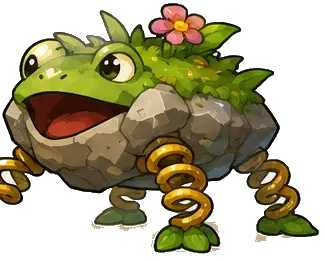

- Category: `monster`
- Role / affinity: Emerald Meadow
- Visual form: Spring-legged rock frog with jump attack.
- Extracted reference size: `325x260`
- Recommended display height at 1080x1920: `210-300 px`; max source texture: `512 px`.
- Anchor: `bottom_center`
- Animation plan: idle(4), attack(5), hit(3), defeat(6)
- Source sheet: `assets/reference_sheets/monster_a.webp`; index `12`
- Status: concept reference. Claude must clean or redraw it before production use.

### `ice_wolf_cub` - Ice Wolf Cub

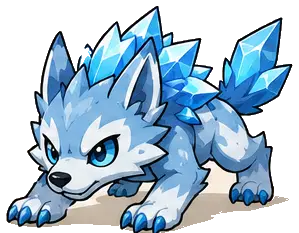

- Category: `monster`
- Role / affinity: Frostpeak Pass
- Visual form: Fast low-profile ice beast.
- Extracted reference size: `299x233`
- Recommended display height at 1080x1920: `210-300 px`; max source texture: `512 px`.
- Anchor: `bottom_center`
- Animation plan: idle(4), attack(5), hit(3), defeat(6)
- Source sheet: `assets/reference_sheets/monster_b.webp`; index `1`
- Status: concept reference. Claude must clean or redraw it before production use.

### `snow_golem` - Snow Golem

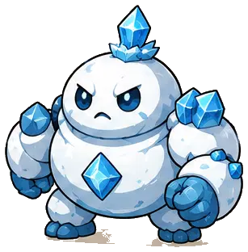

- Category: `monster`
- Role / affinity: Frostpeak Pass
- Visual form: Round heavy snow construct.
- Extracted reference size: `307x312`
- Recommended display height at 1080x1920: `210-300 px`; max source texture: `512 px`.
- Anchor: `bottom_center`
- Animation plan: idle(4), attack(5), hit(3), defeat(6)
- Source sheet: `assets/reference_sheets/monster_b.webp`; index `2`
- Status: concept reference. Claude must clean or redraw it before production use.

### `crystal_beetle` - Crystal Beetle

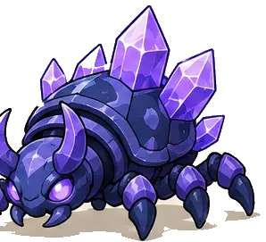

- Category: `monster`
- Role / affinity: Crystal Caverns
- Visual form: Armored crystal insect.
- Extracted reference size: `298x271`
- Recommended display height at 1080x1920: `210-300 px`; max source texture: `512 px`.
- Anchor: `bottom_center`
- Animation plan: idle(4), attack(5), hit(3), defeat(6)
- Source sheet: `assets/reference_sheets/monster_b.webp`; index `3`
- Status: concept reference. Claude must clean or redraw it before production use.

### `frost_moth` - Frost Moth

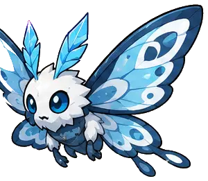

- Category: `monster`
- Role / affinity: Frostpeak Pass
- Visual form: Flying enemy with wide wing silhouette.
- Extracted reference size: `300x261`
- Recommended display height at 1080x1920: `210-300 px`; max source texture: `512 px`.
- Anchor: `bottom_center`
- Animation plan: idle(4), attack(5), hit(3), defeat(6)
- Source sheet: `assets/reference_sheets/monster_b.webp`; index `4`
- Status: concept reference. Claude must clean or redraw it before production use.

### `coral_crab` - Coral Crab

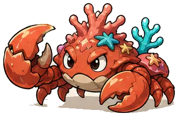

- Category: `monster`
- Role / affinity: Coral Sky Coast
- Visual form: Wide red coral shell attacker.
- Extracted reference size: `349x229`
- Recommended display height at 1080x1920: `210-300 px`; max source texture: `512 px`.
- Anchor: `bottom_center`
- Animation plan: idle(4), attack(5), hit(3), defeat(6)
- Source sheet: `assets/reference_sheets/monster_b.webp`; index `5`
- Status: concept reference. Claude must clean or redraw it before production use.

### `shell_guardian` - Shell Guardian

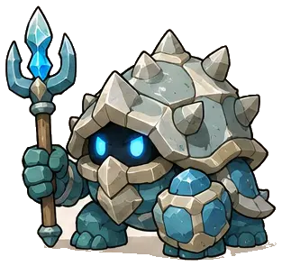

- Category: `monster`
- Role / affinity: Coral Sky Coast
- Visual form: Stone-shell humanoid with trident.
- Extracted reference size: `313x295`
- Recommended display height at 1080x1920: `210-300 px`; max source texture: `512 px`.
- Anchor: `bottom_center`
- Animation plan: idle(4), attack(5), hit(3), defeat(6)
- Source sheet: `assets/reference_sheets/monster_b.webp`; index `6`
- Status: concept reference. Claude must clean or redraw it before production use.

### `floating_jelly` - Floating Jelly

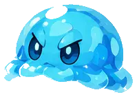

- Category: `monster`
- Role / affinity: Coral Sky Coast
- Visual form: Airborne jelly with soft tentacle motion.
- Extracted reference size: `199x141`
- Recommended display height at 1080x1920: `210-300 px`; max source texture: `512 px`.
- Anchor: `bottom_center`
- Animation plan: idle(4), attack(5), hit(3), defeat(6)
- Source sheet: `assets/reference_sheets/monster_b.webp`; index `7`
- Status: concept reference. Claude must clean or redraw it before production use.

### `frost_tusk_beast` - Frost Tusk Beast

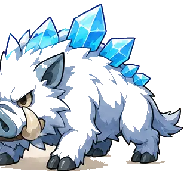

- Category: `monster`
- Role / affinity: Frostpeak Pass
- Visual form: Wide charging snow boar.
- Extracted reference size: `313x294`
- Recommended display height at 1080x1920: `210-300 px`; max source texture: `512 px`.
- Anchor: `bottom_center`
- Animation plan: idle(4), attack(5), hit(3), defeat(6)
- Source sheet: `assets/reference_sheets/monster_b.webp`; index `8`
- Status: concept reference. Claude must clean or redraw it before production use.

### `cave_bat` - Cave Bat

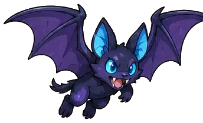

- Category: `monster`
- Role / affinity: Crystal Caverns
- Visual form: Quick flying cave enemy.
- Extracted reference size: `344x209`
- Recommended display height at 1080x1920: `210-300 px`; max source texture: `512 px`.
- Anchor: `bottom_center`
- Animation plan: idle(4), attack(5), hit(3), defeat(6)
- Source sheet: `assets/reference_sheets/monster_b.webp`; index `9`
- Status: concept reference. Claude must clean or redraw it before production use.

### `stalagmite_golem` - Stalagmite Golem

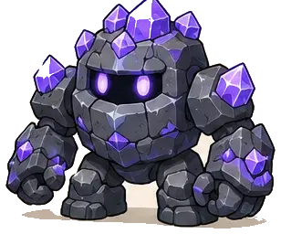

- Category: `monster`
- Role / affinity: Crystal Caverns
- Visual form: Blocky stone-and-crystal brawler.
- Extracted reference size: `308x256`
- Recommended display height at 1080x1920: `210-300 px`; max source texture: `512 px`.
- Anchor: `bottom_center`
- Animation plan: idle(4), attack(5), hit(3), defeat(6)
- Source sheet: `assets/reference_sheets/monster_b.webp`; index `10`
- Status: concept reference. Claude must clean or redraw it before production use.

### `angler_slime` - Angler Slime

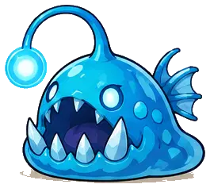

- Category: `monster`
- Role / affinity: Crystal Caverns
- Visual form: Low glowing lure creature.
- Extracted reference size: `265x237`
- Recommended display height at 1080x1920: `210-300 px`; max source texture: `512 px`.
- Anchor: `bottom_center`
- Animation plan: idle(4), attack(5), hit(3), defeat(6)
- Source sheet: `assets/reference_sheets/monster_b.webp`; index `11`
- Status: concept reference. Claude must clean or redraw it before production use.

### `shard_serpent` - Shard Serpent

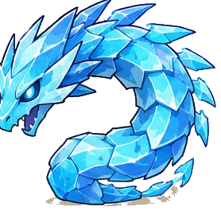

- Category: `monster`
- Role / affinity: Crystal Caverns
- Visual form: Long coiled crystal snake.
- Extracted reference size: `278x265`
- Recommended display height at 1080x1920: `210-300 px`; max source texture: `512 px`.
- Anchor: `bottom_center`
- Animation plan: idle(4), attack(5), hit(3), defeat(6)
- Source sheet: `assets/reference_sheets/monster_b.webp`; index `12`
- Status: concept reference. Claude must clean or redraw it before production use.

### `ember_imp` - Ember Imp

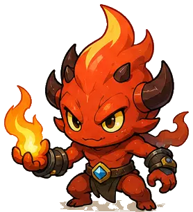

- Category: `monster`
- Role / affinity: Obsidian Citadel
- Visual form: Small fire caster with horned silhouette.
- Extracted reference size: `278x306`
- Recommended display height at 1080x1920: `210-300 px`; max source texture: `512 px`.
- Anchor: `bottom_center`
- Animation plan: idle(4), attack(5), hit(3), defeat(6)
- Source sheet: `assets/reference_sheets/monster_c.webp`; index `1`
- Status: concept reference. Claude must clean or redraw it before production use.

### `lava_tortoise` - Lava Tortoise

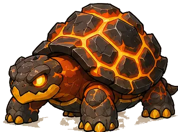

- Category: `monster`
- Role / affinity: Obsidian Citadel
- Visual form: Heavy lava-shell defender.
- Extracted reference size: `355x263`
- Recommended display height at 1080x1920: `210-300 px`; max source texture: `512 px`.
- Anchor: `bottom_center`
- Animation plan: idle(4), attack(5), hit(3), defeat(6)
- Source sheet: `assets/reference_sheets/monster_c.webp`; index `2`
- Status: concept reference. Claude must clean or redraw it before production use.

### `smoke_wisp` - Smoke Wisp

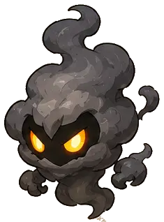

- Category: `monster`
- Role / affinity: Obsidian Citadel
- Visual form: Floating smoke enemy with glowing eyes.
- Extracted reference size: `235x318`
- Recommended display height at 1080x1920: `210-300 px`; max source texture: `512 px`.
- Anchor: `bottom_center`
- Animation plan: idle(4), attack(5), hit(3), defeat(6)
- Source sheet: `assets/reference_sheets/monster_c.webp`; index `3`
- Status: concept reference. Claude must clean or redraw it before production use.

### `obsidian_beetle` - Obsidian Beetle


- Category: `monster`
- Role / affinity: Obsidian Citadel
- Visual form: Dark armored beetle with purple core.
- Extracted reference size: `292x230`
- Recommended display height at 1080x1920: `210-300 px`; max source texture: `512 px`.
- Anchor: `bottom_center`
- Animation plan: idle(4), attack(5), hit(3), defeat(6)
- Source sheet: `assets/reference_sheets/monster_c.webp`; index `4`
- Status: concept reference. Claude must clean or redraw it before production use.

### `gear_goblin` - Gear Goblin


- Category: `monster`
- Role / affinity: Clockwork City
- Visual form: Mechanical tool user and fast melee enemy.
- Extracted reference size: `283x280`
- Recommended display height at 1080x1920: `210-300 px`; max source texture: `512 px`.
- Anchor: `bottom_center`
- Animation plan: idle(4), attack(5), hit(3), defeat(6)
- Source sheet: `assets/reference_sheets/monster_c.webp`; index `5`
- Status: concept reference. Claude must clean or redraw it before production use.

### `clockwork_hound` - Clockwork Hound


- Category: `monster`
- Role / affinity: Clockwork City
- Visual form: Mechanical dog with wind-up key.
- Extracted reference size: `325x284`
- Recommended display height at 1080x1920: `210-300 px`; max source texture: `512 px`.
- Anchor: `bottom_center`
- Animation plan: idle(4), attack(5), hit(3), defeat(6)
- Source sheet: `assets/reference_sheets/monster_c.webp`; index `6`
- Status: concept reference. Claude must clean or redraw it before production use.

### `wind_cloud` - Wind Cloud


- Category: `monster`
- Role / affinity: Storm Isles
- Visual form: Floating gust enemy with soft cloud body.
- Extracted reference size: `273x243`
- Recommended display height at 1080x1920: `210-300 px`; max source texture: `512 px`.
- Anchor: `bottom_center`
- Animation plan: idle(4), attack(5), hit(3), defeat(6)
- Source sheet: `assets/reference_sheets/monster_c.webp`; index `7`
- Status: concept reference. Claude must clean or redraw it before production use.

### `thunder_ram` - Thunder Ram


- Category: `monster`
- Role / affinity: Storm Isles
- Visual form: Charging horned beast with lightning accents.
- Extracted reference size: `266x278`
- Recommended display height at 1080x1920: `210-300 px`; max source texture: `512 px`.
- Anchor: `bottom_center`
- Animation plan: idle(4), attack(5), hit(3), defeat(6)
- Source sheet: `assets/reference_sheets/monster_c.webp`; index `8`
- Status: concept reference. Claude must clean or redraw it before production use.

### `star_jelly` - Star Jelly


- Category: `monster`
- Role / affinity: Astral Temple
- Visual form: Cosmic jelly with star core.
- Extracted reference size: `269x276`
- Recommended display height at 1080x1920: `210-300 px`; max source texture: `512 px`.
- Anchor: `bottom_center`
- Animation plan: idle(4), attack(5), hit(3), defeat(6)
- Source sheet: `assets/reference_sheets/monster_c.webp`; index `9`
- Status: concept reference. Claude must clean or redraw it before production use.

### `cosmic_owl` - Cosmic Owl


- Category: `monster`
- Role / affinity: Astral Temple
- Visual form: Flying guardian with broad eye silhouette.
- Extracted reference size: `258x273`
- Recommended display height at 1080x1920: `210-300 px`; max source texture: `512 px`.
- Anchor: `bottom_center`
- Animation plan: idle(4), attack(5), hit(3), defeat(6)
- Source sheet: `assets/reference_sheets/monster_c.webp`; index `10`
- Status: concept reference. Claude must clean or redraw it before production use.

### `rune_guardian` - Rune Guardian


- Category: `monster`
- Role / affinity: Astral Temple
- Visual form: Stone construct with purple runes.
- Extracted reference size: `294x275`
- Recommended display height at 1080x1920: `210-300 px`; max source texture: `512 px`.
- Anchor: `bottom_center`
- Animation plan: idle(4), attack(5), hit(3), defeat(6)
- Source sheet: `assets/reference_sheets/monster_c.webp`; index `11`
- Status: concept reference. Claude must clean or redraw it before production use.

### `plasma_serpent` - Plasma Serpent


- Category: `monster`
- Role / affinity: Astral Temple
- Visual form: Small coiled energy serpent.
- Extracted reference size: `231x262`
- Recommended display height at 1080x1920: `210-300 px`; max source texture: `512 px`.
- Anchor: `bottom_center`
- Animation plan: idle(4), attack(5), hit(3), defeat(6)
- Source sheet: `assets/reference_sheets/monster_c.webp`; index `12`
- Status: concept reference. Claude must clean or redraw it before production use.


# Bosses

### `purple_fortress_boss` - Purple Fortress Boss


- Category: `boss`
- Role / affinity: Primary fortress boss
- Visual form: Massive purple horned boss with oversized gauntlet.
- Extracted reference size: `560x404`
- Recommended display height at 1080x1920: `420-560 px`; max source texture: `768 px`.
- Anchor: `bottom_center`
- Animation plan: idle(6), attack(8), hit(3), enraged(6), defeat(10)
- Source sheet: `assets/reference_sheets/base.webp`; index `9`
- Status: concept reference. Claude must clean or redraw it before production use.

### `ancient_treant` - Ancient Treant


- Category: `boss`
- Role / affinity: Emerald Meadow
- Visual form: Tall branch-armed guardian with slam attacks.
- Extracted reference size: `500x474`
- Recommended display height at 1080x1920: `420-560 px`; max source texture: `768 px`.
- Anchor: `bottom_center`
- Animation plan: idle(6), attack(8), hit(3), enraged(6), defeat(10)
- Source sheet: `assets/reference_sheets/boss_a.webp`; index `1`
- Status: concept reference. Claude must clean or redraw it before production use.

### `mushroom_monarch` - Mushroom Monarch


- Category: `boss`
- Role / affinity: Moonlit Wildwood
- Visual form: Wide crowned mushroom with heavy punches.
- Extracted reference size: `427x412`
- Recommended display height at 1080x1920: `420-560 px`; max source texture: `768 px`.
- Anchor: `bottom_center`
- Animation plan: idle(6), attack(8), hit(3), enraged(6), defeat(10)
- Source sheet: `assets/reference_sheets/boss_a.webp`; index `2`
- Status: concept reference. Claude must clean or redraw it before production use.

### `frost_tusk_mammoth` - Frost Tusk Mammoth


- Category: `boss`
- Role / affinity: Frostpeak Pass
- Visual form: Massive ice tusks and charge attack.
- Extracted reference size: `494x448`
- Recommended display height at 1080x1920: `420-560 px`; max source texture: `768 px`.
- Anchor: `bottom_center`
- Animation plan: idle(6), attack(8), hit(3), enraged(6), defeat(10)
- Source sheet: `assets/reference_sheets/boss_a.webp`; index `3`
- Status: concept reference. Claude must clean or redraw it before production use.

### `coral_shell_titan` - Coral Shell Titan


- Category: `boss`
- Role / affinity: Coral Sky Coast
- Visual form: Very wide crab silhouette and claw combo.
- Extracted reference size: `507x415`
- Recommended display height at 1080x1920: `420-560 px`; max source texture: `768 px`.
- Anchor: `bottom_center`
- Animation plan: idle(6), attack(8), hit(3), enraged(6), defeat(10)
- Source sheet: `assets/reference_sheets/boss_a.webp`; index `4`
- Status: concept reference. Claude must clean or redraw it before production use.

### `crystal_cavern_wyrm` - Crystal Cavern Wyrm


- Category: `boss`
- Role / affinity: Crystal Caverns
- Visual form: Long coiled boss with crystal sweep.
- Extracted reference size: `474x402`
- Recommended display height at 1080x1920: `420-560 px`; max source texture: `768 px`.
- Anchor: `bottom_center`
- Animation plan: idle(6), attack(8), hit(3), enraged(6), defeat(10)
- Source sheet: `assets/reference_sheets/boss_a.webp`; index `5`
- Status: concept reference. Claude must clean or redraw it before production use.

### `storm_thunder_roc` - Storm Thunder Roc


- Category: `boss`
- Role / affinity: Storm Isles
- Visual form: Large flying boss with lightning dive.
- Extracted reference size: `512x419`
- Recommended display height at 1080x1920: `420-560 px`; max source texture: `768 px`.
- Anchor: `bottom_center`
- Animation plan: idle(6), attack(8), hit(3), enraged(6), defeat(10)
- Source sheet: `assets/reference_sheets/boss_a.webp`; index `6`
- Status: concept reference. Claude must clean or redraw it before production use.

### `clockwork_crown_king` - Clockwork Crown King


- Category: `boss`
- Role / affinity: Clockwork City
- Visual form: Tall mechanical king with ranged cannon hand.
- Extracted reference size: `456x419`
- Recommended display height at 1080x1920: `420-560 px`; max source texture: `768 px`.
- Anchor: `bottom_center`
- Animation plan: idle(6), attack(8), hit(3), enraged(6), defeat(10)
- Source sheet: `assets/reference_sheets/boss_b.webp`; index `1`
- Status: concept reference. Claude must clean or redraw it before production use.

### `magma_horn_beast` - Magma Horn Beast


- Category: `boss`
- Role / affinity: Obsidian Citadel
- Visual form: Low massive volcanic charge boss.
- Extracted reference size: `499x422`
- Recommended display height at 1080x1920: `420-560 px`; max source texture: `768 px`.
- Anchor: `bottom_center`
- Animation plan: idle(6), attack(8), hit(3), enraged(6), defeat(10)
- Source sheet: `assets/reference_sheets/boss_b.webp`; index `2`
- Status: concept reference. Claude must clean or redraw it before production use.

### `whispering_marsh_hydra` - Whispering Marsh Hydra


- Category: `boss`
- Role / affinity: Whispering Marsh
- Visual form: Three rounded heads with alternating attacks.
- Extracted reference size: `477x428`
- Recommended display height at 1080x1920: `420-560 px`; max source texture: `768 px`.
- Anchor: `bottom_center`
- Animation plan: idle(6), attack(8), hit(3), enraged(6), defeat(10)
- Source sheet: `assets/reference_sheets/boss_b.webp`; index `3`
- Status: concept reference. Claude must clean or redraw it before production use.

### `celestial_owl_guardian` - Celestial Owl Guardian


- Category: `boss`
- Role / affinity: Astral Temple
- Visual form: Floating winged caster boss.
- Extracted reference size: `467x398`
- Recommended display height at 1080x1920: `420-560 px`; max source texture: `768 px`.
- Anchor: `bottom_center`
- Animation plan: idle(6), attack(8), hit(3), enraged(6), defeat(10)
- Source sheet: `assets/reference_sheets/boss_b.webp`; index `4`
- Status: concept reference. Claude must clean or redraw it before production use.

### `storm_sea_leviathan` - Storm Sea Leviathan


- Category: `boss`
- Role / affinity: Storm Isles
- Visual form: Long water serpent with wave attack.
- Extracted reference size: `472x445`
- Recommended display height at 1080x1920: `420-560 px`; max source texture: `768 px`.
- Anchor: `bottom_center`
- Animation plan: idle(6), attack(8), hit(3), enraged(6), defeat(10)
- Source sheet: `assets/reference_sheets/boss_b.webp`; index `5`
- Status: concept reference. Claude must clean or redraw it before production use.

### `cosmic_star_knight` - Cosmic Star Knight


- Category: `boss`
- Role / affinity: Astral Temple
- Visual form: Armored final boss with giant star shield.
- Extracted reference size: `497x436`
- Recommended display height at 1080x1920: `420-560 px`; max source texture: `768 px`.
- Anchor: `bottom_center`
- Animation plan: idle(6), attack(8), hit(3), enraged(6), defeat(10)
- Source sheet: `assets/reference_sheets/boss_b.webp`; index `6`
- Status: concept reference. Claude must clean or redraw it before production use.


# Weapons

### `iron_short_sword` - Iron Short Sword


- Category: `weapon`
- Role / affinity: sword
- Visual form: Common neutral starter sword.
- Extracted reference size: `205x256`
- Recommended runtime icon: `192x192` with `12%` transparent padding.
- Anchor: `center`
- Animation plan: Static inventory icon.
- Source sheet: `assets/reference_sheets/weapon_melee.webp`; index `1`
- Status: concept reference. Claude must clean or redraw it before production use.

### `grove_blade` - Grove Blade


- Category: `weapon`
- Role / affinity: sword
- Visual form: Nature-themed rare sword.
- Extracted reference size: `208x256`
- Recommended runtime icon: `192x192` with `12%` transparent padding.
- Anchor: `center`
- Animation plan: Static inventory icon.
- Source sheet: `assets/reference_sheets/weapon_melee.webp`; index `2`
- Status: concept reference. Claude must clean or redraw it before production use.

### `prism_sword` - Prism Sword


- Category: `weapon`
- Role / affinity: sword
- Visual form: Crystal epic sword.
- Extracted reference size: `199x256`
- Recommended runtime icon: `192x192` with `12%` transparent padding.
- Anchor: `center`
- Animation plan: Static inventory icon.
- Source sheet: `assets/reference_sheets/weapon_melee.webp`; index `3`
- Status: concept reference. Claude must clean or redraw it before production use.

### `ember_blade` - Ember Blade


- Category: `weapon`
- Role / affinity: sword
- Visual form: Fire legendary sword.
- Extracted reference size: `206x256`
- Recommended runtime icon: `192x192` with `12%` transparent padding.
- Anchor: `center`
- Animation plan: Static inventory icon.
- Source sheet: `assets/reference_sheets/weapon_melee.webp`; index `4`
- Status: concept reference. Claude must clean or redraw it before production use.

### `skyguard_sword` - Skyguard Sword


- Category: `weapon`
- Role / affinity: sword
- Visual form: Light-and-wind sword.
- Extracted reference size: `168x256`
- Recommended runtime icon: `192x192` with `12%` transparent padding.
- Anchor: `center`
- Animation plan: Static inventory icon.
- Source sheet: `assets/reference_sheets/weapon_melee.webp`; index `5`
- Status: concept reference. Claude must clean or redraw it before production use.

### `woodsman_axe` - Woodsman Axe


- Category: `weapon`
- Role / affinity: axe
- Visual form: Common wood-and-iron axe.
- Extracted reference size: `227x256`
- Recommended runtime icon: `192x192` with `12%` transparent padding.
- Anchor: `center`
- Animation plan: Static inventory icon.
- Source sheet: `assets/reference_sheets/weapon_melee.webp`; index `6`
- Status: concept reference. Claude must clean or redraw it before production use.

### `frost_twin_axe` - Frost Twin Axe


- Category: `weapon`
- Role / affinity: axe
- Visual form: Ice double-headed axe.
- Extracted reference size: `211x256`
- Recommended runtime icon: `192x192` with `12%` transparent padding.
- Anchor: `center`
- Animation plan: Static inventory icon.
- Source sheet: `assets/reference_sheets/weapon_melee.webp`; index `7`
- Status: concept reference. Claude must clean or redraw it before production use.

### `oak_maul` - Oak Maul


- Category: `weapon`
- Role / affinity: hammer
- Visual form: Heavy wooden common maul.
- Extracted reference size: `218x256`
- Recommended runtime icon: `192x192` with `12%` transparent padding.
- Anchor: `center`
- Animation plan: Static inventory icon.
- Source sheet: `assets/reference_sheets/weapon_melee.webp`; index `8`
- Status: concept reference. Claude must clean or redraw it before production use.

### `amethyst_maul` - Amethyst Maul


- Category: `weapon`
- Role / affinity: hammer
- Visual form: Purple crystal epic hammer.
- Extracted reference size: `206x254`
- Recommended runtime icon: `192x192` with `12%` transparent padding.
- Anchor: `center`
- Animation plan: Static inventory icon.
- Source sheet: `assets/reference_sheets/weapon_melee.webp`; index `9`
- Status: concept reference. Claude must clean or redraw it before production use.

### `sunstone_hammer` - Sunstone Hammer


- Category: `weapon`
- Role / affinity: hammer
- Visual form: Gold-and-green legendary hammer.
- Extracted reference size: `207x256`
- Recommended runtime icon: `192x192` with `12%` transparent padding.
- Anchor: `center`
- Animation plan: Static inventory icon.
- Source sheet: `assets/reference_sheets/weapon_melee.webp`; index `10`
- Status: concept reference. Claude must clean or redraw it before production use.

### `stone_spear` - Stone Spear


- Category: `weapon`
- Role / affinity: spear
- Visual form: Common stone-tipped spear.
- Extracted reference size: `173x256`
- Recommended runtime icon: `192x192` with `12%` transparent padding.
- Anchor: `center`
- Animation plan: Static inventory icon.
- Source sheet: `assets/reference_sheets/weapon_melee.webp`; index `11`
- Status: concept reference. Claude must clean or redraw it before production use.

### `frost_lance` - Frost Lance


- Category: `weapon`
- Role / affinity: spear
- Visual form: Long ice rare spear.
- Extracted reference size: `189x256`
- Recommended runtime icon: `192x192` with `12%` transparent padding.
- Anchor: `center`
- Animation plan: Static inventory icon.
- Source sheet: `assets/reference_sheets/weapon_melee.webp`; index `12`
- Status: concept reference. Claude must clean or redraw it before production use.

### `twin_leaf_daggers` - Twin Leaf Daggers


- Category: `weapon`
- Role / affinity: daggers
- Visual form: Fast nature dagger pair.
- Extracted reference size: `175x217`
- Recommended runtime icon: `192x192` with `12%` transparent padding.
- Anchor: `center`
- Animation plan: Static inventory icon.
- Source sheet: `assets/reference_sheets/weapon_melee.webp`; index `13`
- Status: concept reference. Claude must clean or redraw it before production use.

### `twin_void_daggers` - Twin Void Daggers


- Category: `weapon`
- Role / affinity: daggers
- Visual form: Purple critical dagger pair.
- Extracted reference size: `149x250`
- Recommended runtime icon: `192x192` with `12%` transparent padding.
- Anchor: `center`
- Animation plan: Static inventory icon.
- Source sheet: `assets/reference_sheets/weapon_melee.webp`; index `14`
- Status: concept reference. Claude must clean or redraw it before production use.

### `iron_round_shield` - Iron Round Shield


- Category: `weapon`
- Role / affinity: shield
- Visual form: Common defensive round shield.
- Extracted reference size: `198x244`
- Recommended runtime icon: `192x192` with `12%` transparent padding.
- Anchor: `center`
- Animation plan: Static inventory icon.
- Source sheet: `assets/reference_sheets/weapon_melee.webp`; index `15`
- Status: concept reference. Claude must clean or redraw it before production use.

### `skyguard_shield` - Skyguard Shield


- Category: `weapon`
- Role / affinity: shield
- Visual form: Winged blue legendary shield.
- Extracted reference size: `203x253`
- Recommended runtime icon: `192x192` with `12%` transparent padding.
- Anchor: `center`
- Animation plan: Static inventory icon.
- Source sheet: `assets/reference_sheets/weapon_melee.webp`; index `16`
- Status: concept reference. Claude must clean or redraw it before production use.

### `grove_bow` - Grove Bow


- Category: `weapon`
- Role / affinity: bow
- Visual form: Common nature bow.
- Extracted reference size: `191x256`
- Recommended runtime icon: `192x192` with `12%` transparent padding.
- Anchor: `center`
- Animation plan: Static inventory icon.
- Source sheet: `assets/reference_sheets/weapon_magic.webp`; index `1`
- Status: concept reference. Claude must clean or redraw it before production use.

### `frost_bow` - Frost Bow


- Category: `weapon`
- Role / affinity: bow
- Visual form: Ice slow-effect bow.
- Extracted reference size: `215x256`
- Recommended runtime icon: `192x192` with `12%` transparent padding.
- Anchor: `center`
- Animation plan: Static inventory icon.
- Source sheet: `assets/reference_sheets/weapon_magic.webp`; index `2`
- Status: concept reference. Claude must clean or redraw it before production use.

### `void_bow` - Void Bow


- Category: `weapon`
- Role / affinity: bow
- Visual form: Purple critical bow.
- Extracted reference size: `211x256`
- Recommended runtime icon: `192x192` with `12%` transparent padding.
- Anchor: `center`
- Animation plan: Static inventory icon.
- Source sheet: `assets/reference_sheets/weapon_magic.webp`; index `3`
- Status: concept reference. Claude must clean or redraw it before production use.

### `sunwing_bow` - Sunwing Bow


- Category: `weapon`
- Role / affinity: bow
- Visual form: Gold legendary bow.
- Extracted reference size: `200x256`
- Recommended runtime icon: `192x192` with `12%` transparent padding.
- Anchor: `center`
- Animation plan: Static inventory icon.
- Source sheet: `assets/reference_sheets/weapon_magic.webp`; index `4`
- Status: concept reference. Claude must clean or redraw it before production use.

### `grove_crossbow` - Grove Crossbow


- Category: `weapon`
- Role / affinity: crossbow
- Visual form: Compact nature crossbow.
- Extracted reference size: `243x211`
- Recommended runtime icon: `192x192` with `12%` transparent padding.
- Anchor: `center`
- Animation plan: Static inventory icon.
- Source sheet: `assets/reference_sheets/weapon_magic.webp`; index `5`
- Status: concept reference. Claude must clean or redraw it before production use.

### `frost_crossbow` - Frost Crossbow


- Category: `weapon`
- Role / affinity: crossbow
- Visual form: Blue heavy crossbow.
- Extracted reference size: `250x233`
- Recommended runtime icon: `192x192` with `12%` transparent padding.
- Anchor: `center`
- Animation plan: Static inventory icon.
- Source sheet: `assets/reference_sheets/weapon_magic.webp`; index `6`
- Status: concept reference. Claude must clean or redraw it before production use.

### `grove_orb_staff` - Grove Orb Staff


- Category: `weapon`
- Role / affinity: staff
- Visual form: Nature support staff.
- Extracted reference size: `209x256`
- Recommended runtime icon: `192x192` with `12%` transparent padding.
- Anchor: `center`
- Animation plan: Static inventory icon.
- Source sheet: `assets/reference_sheets/weapon_magic.webp`; index `7`
- Status: concept reference. Claude must clean or redraw it before production use.

### `crystal_staff` - Crystal Staff


- Category: `weapon`
- Role / affinity: staff
- Visual form: Blue crystal damage staff.
- Extracted reference size: `186x256`
- Recommended runtime icon: `192x192` with `12%` transparent padding.
- Anchor: `center`
- Animation plan: Static inventory icon.
- Source sheet: `assets/reference_sheets/weapon_magic.webp`; index `8`
- Status: concept reference. Claude must clean or redraw it before production use.

### `void_orb_staff` - Void Orb Staff


- Category: `weapon`
- Role / affinity: staff
- Visual form: Purple arcane staff.
- Extracted reference size: `201x256`
- Recommended runtime icon: `192x192` with `12%` transparent padding.
- Anchor: `center`
- Animation plan: Static inventory icon.
- Source sheet: `assets/reference_sheets/weapon_magic.webp`; index `9`
- Status: concept reference. Claude must clean or redraw it before production use.

### `sun_staff` - Sun Staff


- Category: `weapon`
- Role / affinity: staff
- Visual form: Gold healing staff.
- Extracted reference size: `158x256`
- Recommended runtime icon: `192x192` with `12%` transparent padding.
- Anchor: `center`
- Animation plan: Static inventory icon.
- Source sheet: `assets/reference_sheets/weapon_magic.webp`; index `10`
- Status: concept reference. Claude must clean or redraw it before production use.

### `star_wand` - Star Wand


- Category: `weapon`
- Role / affinity: wand
- Visual form: Bright star skill wand.
- Extracted reference size: `195x255`
- Recommended runtime icon: `192x192` with `12%` transparent padding.
- Anchor: `center`
- Animation plan: Static inventory icon.
- Source sheet: `assets/reference_sheets/weapon_magic.webp`; index `11`
- Status: concept reference. Claude must clean or redraw it before production use.

### `amethyst_wand` - Amethyst Wand


- Category: `weapon`
- Role / affinity: wand
- Visual form: Purple cooldown wand.
- Extracted reference size: `181x256`
- Recommended runtime icon: `192x192` with `12%` transparent padding.
- Anchor: `center`
- Animation plan: Static inventory icon.
- Source sheet: `assets/reference_sheets/weapon_magic.webp`; index `12`
- Status: concept reference. Claude must clean or redraw it before production use.

### `astral_spellbook` - Astral Spellbook


- Category: `weapon`
- Role / affinity: spellbook
- Visual form: Floating magic book.
- Extracted reference size: `256x244`
- Recommended runtime icon: `192x192` with `12%` transparent padding.
- Anchor: `center`
- Animation plan: Static inventory icon.
- Source sheet: `assets/reference_sheets/weapon_magic.webp`; index `13`
- Status: concept reference. Claude must clean or redraw it before production use.

### `verdant_crystal_orb` - Verdant Crystal Orb


- Category: `weapon`
- Role / affinity: orb
- Visual form: Green crystal support orb.
- Extracted reference size: `217x253`
- Recommended runtime icon: `192x192` with `12%` transparent padding.
- Anchor: `center`
- Animation plan: Static inventory icon.
- Source sheet: `assets/reference_sheets/weapon_magic.webp`; index `14`
- Status: concept reference. Claude must clean or redraw it before production use.

### `alchemist_launcher` - Alchemist Launcher


- Category: `weapon`
- Role / affinity: launcher
- Visual form: Potion projectile weapon.
- Extracted reference size: `248x217`
- Recommended runtime icon: `192x192` with `12%` transparent padding.
- Anchor: `center`
- Animation plan: Static inventory icon.
- Source sheet: `assets/reference_sheets/weapon_magic.webp`; index `15`
- Status: concept reference. Claude must clean or redraw it before production use.


# Companions

### `falcon_companion` - Falcon Companion


- Category: `companion`
- Role / affinity: Ranged companion
- Visual form: Small flying falcon; quick dive attack and cyan damage number.
- Extracted reference size: `236x235`
- Recommended display height at 1080x1920: `110-180 px`; max source texture: `320 px`.
- Anchor: `bottom_center`
- Animation plan: idle(4), attack(5), hit(3), victory(5)
- Source sheet: `assets/reference_sheets/base.webp`; index `2`
- Status: concept reference. Claude must clean or redraw it before production use.

### `baby_griffin` - Baby Griffin


- Category: `companion`
- Role / affinity: Air dash attacker
- Visual form: Fast dive attack; small airborne silhouette.
- Extracted reference size: `286x287`
- Recommended display height at 1080x1920: `110-180 px`; max source texture: `320 px`.
- Anchor: `bottom_center`
- Animation plan: idle(4), attack(5), hit(3), victory(5)
- Source sheet: `assets/reference_sheets/companions.webp`; index `1`
- Status: concept reference. Claude must clean or redraw it before production use.

### `fire_fox` - Fire Fox


- Category: `companion`
- Role / affinity: Fire burst attacker
- Visual form: Short flame dash and burn effect.
- Extracted reference size: `320x310`
- Recommended display height at 1080x1920: `110-180 px`; max source texture: `320 px`.
- Anchor: `bottom_center`
- Animation plan: idle(4), attack(5), hit(3), victory(5)
- Source sheet: `assets/reference_sheets/companions.webp`; index `2`
- Status: concept reference. Claude must clean or redraw it before production use.

### `water_otter` - Water Otter


- Category: `companion`
- Role / affinity: Water projectile attacker
- Visual form: Throws a small water orb.
- Extracted reference size: `268x265`
- Recommended display height at 1080x1920: `110-180 px`; max source texture: `320 px`.
- Anchor: `bottom_center`
- Animation plan: idle(4), attack(5), hit(3), victory(5)
- Source sheet: `assets/reference_sheets/companions.webp`; index `3`
- Status: concept reference. Claude must clean or redraw it before production use.

### `stone_turtle` - Stone Turtle


- Category: `companion`
- Role / affinity: Defensive companion
- Visual form: Slow attack and protection bonus.
- Extracted reference size: `296x271`
- Recommended display height at 1080x1920: `110-180 px`; max source texture: `320 px`.
- Anchor: `bottom_center`
- Animation plan: idle(4), attack(5), hit(3), victory(5)
- Source sheet: `assets/reference_sheets/companions.webp`; index `4`
- Status: concept reference. Claude must clean or redraw it before production use.

### `moon_owl` - Moon Owl


- Category: `companion`
- Role / affinity: Magic projectile companion
- Visual form: Moon orb attack and cooldown support.
- Extracted reference size: `291x253`
- Recommended display height at 1080x1920: `110-180 px`; max source texture: `320 px`.
- Anchor: `bottom_center`
- Animation plan: idle(4), attack(5), hit(3), victory(5)
- Source sheet: `assets/reference_sheets/companions.webp`; index `5`
- Status: concept reference. Claude must clean or redraw it before production use.

### `clockwork_dog` - Clockwork Dog


- Category: `companion`
- Role / affinity: Rapid mechanical attacker
- Visual form: Quick bite and gear projectile.
- Extracted reference size: `318x270`
- Recommended display height at 1080x1920: `110-180 px`; max source texture: `320 px`.
- Anchor: `bottom_center`
- Animation plan: idle(4), attack(5), hit(3), victory(5)
- Source sheet: `assets/reference_sheets/companions.webp`; index `6`
- Status: concept reference. Claude must clean or redraw it before production use.

### `forest_sprite` - Forest Sprite


- Category: `companion`
- Role / affinity: Healing companion
- Visual form: Leaf projectile and support aura.
- Extracted reference size: `309x288`
- Recommended display height at 1080x1920: `110-180 px`; max source texture: `320 px`.
- Anchor: `bottom_center`
- Animation plan: idle(4), attack(5), hit(3), victory(5)
- Source sheet: `assets/reference_sheets/companions.webp`; index `7`
- Status: concept reference. Claude must clean or redraw it before production use.

### `crystal_dragon_hatchling` - Crystal Dragon Hatchling


- Category: `companion`
- Role / affinity: Crystal breath attacker
- Visual form: Short ranged crystal breath.
- Extracted reference size: `320x280`
- Recommended display height at 1080x1920: `110-180 px`; max source texture: `320 px`.
- Anchor: `bottom_center`
- Animation plan: idle(4), attack(5), hit(3), victory(5)
- Source sheet: `assets/reference_sheets/companions.webp`; index `8`
- Status: concept reference. Claude must clean or redraw it before production use.

### `storm_cloud_ram` - Storm Cloud Ram


- Category: `companion`
- Role / affinity: Lightning attacker
- Visual form: Charge and small lightning strike.
- Extracted reference size: `285x274`
- Recommended display height at 1080x1920: `110-180 px`; max source texture: `320 px`.
- Anchor: `bottom_center`
- Animation plan: idle(4), attack(5), hit(3), victory(5)
- Source sheet: `assets/reference_sheets/companions.webp`; index `9`
- Status: concept reference. Claude must clean or redraw it before production use.

### `star_jelly_companion` - Star Jelly Companion


- Category: `companion`
- Role / affinity: Astral support
- Visual form: Floating star projectile.
- Extracted reference size: `251x268`
- Recommended display height at 1080x1920: `110-180 px`; max source texture: `320 px`.
- Anchor: `bottom_center`
- Animation plan: idle(4), attack(5), hit(3), victory(5)
- Source sheet: `assets/reference_sheets/companions.webp`; index `10`
- Status: concept reference. Claude must clean or redraw it before production use.

### `boar_mount` - Boar Mount


- Category: `companion`
- Role / affinity: Charge attacker
- Visual form: Ground rush with knockback reaction.
- Extracted reference size: `320x244`
- Recommended display height at 1080x1920: `110-180 px`; max source texture: `320 px`.
- Anchor: `bottom_center`
- Animation plan: idle(4), attack(5), hit(3), victory(5)
- Source sheet: `assets/reference_sheets/companions.webp`; index `11`
- Status: concept reference. Claude must clean or redraw it before production use.

### `mushroom_buddy` - Mushroom Buddy


- Category: `companion`
- Role / affinity: Buff companion
- Visual form: Spore puff and gold-support identity.
- Extracted reference size: `266x263`
- Recommended display height at 1080x1920: `110-180 px`; max source texture: `320 px`.
- Anchor: `bottom_center`
- Animation plan: idle(4), attack(5), hit(3), victory(5)
- Source sheet: `assets/reference_sheets/companions.webp`; index `12`
- Status: concept reference. Claude must clean or redraw it before production use.


# Worlds

## `oasis_frontier` - Emerald Meadow


- Stage range / status: `1-33`
- Visual form: Bright grassland, blue crystals, and friendly ruins.
- Suggested enemies: `honey_slime`, `sproutling`, `pebble_crab`, `leaf_fox`, `acorn_brute`
- Reference size: `540x959`
- Runtime master: `1080x1920`.
- Layers: sky, midground, arena, foreground; maximum four active parallax layers.
- Safe zones: top 18% HUD, center 50% combat, bottom 30% hero and controls.
- Save note: The first three IDs are existing stable IDs. Future IDs require an approved content-structure change before use.

## `moonlit_dunes` - Moonlit Wildwood


- Stage range / status: `34-66`
- Visual form: Blue-purple forest with moonlight and glowing mushrooms.
- Suggested enemies: `mushroom_guard`, `vine_snapper`, `pollen_wisp`
- Reference size: `540x959`
- Runtime master: `1080x1920`.
- Layers: sky, midground, arena, foreground; maximum four active parallax layers.
- Safe zones: top 18% HUD, center 50% combat, bottom 30% hero and controls.
- Save note: The first three IDs are existing stable IDs. Future IDs require an approved content-structure change before use.

## `ruins_of_the_sun_kingdom` - Obsidian Citadel


- Stage range / status: `67-100`
- Visual form: Volcanic fortress with magenta crystals and controlled lava.
- Suggested enemies: `ember_imp`, `lava_tortoise`, `smoke_wisp`, `obsidian_beetle`
- Reference size: `540x959`
- Runtime master: `1080x1920`.
- Layers: sky, midground, arena, foreground; maximum four active parallax layers.
- Safe zones: top 18% HUD, center 50% combat, bottom 30% hero and controls.
- Save note: The first three IDs are existing stable IDs. Future IDs require an approved content-structure change before use.

## `frostpeak_pass` - Frostpeak Pass


- Stage range / status: `Future`
- Visual form: Snow mountains, frozen waterfall, and blue crystal arena.
- Suggested enemies: `ice_wolf_cub`, `snow_golem`, `frost_moth`, `frost_tusk_beast`
- Reference size: `540x959`
- Runtime master: `1080x1920`.
- Layers: sky, midground, arena, foreground; maximum four active parallax layers.
- Safe zones: top 18% HUD, center 50% combat, bottom 30% hero and controls.
- Save note: The first three IDs are existing stable IDs. Future IDs require an approved content-structure change before use.

## `crystal_caverns` - Crystal Caverns


- Stage range / status: `Future`
- Visual form: Underground crystal cave and glowing mineral pools.
- Suggested enemies: `crystal_beetle`, `cave_bat`, `stalagmite_golem`, `angler_slime`, `shard_serpent`
- Reference size: `540x959`
- Runtime master: `1080x1920`.
- Layers: sky, midground, arena, foreground; maximum four active parallax layers.
- Safe zones: top 18% HUD, center 50% combat, bottom 30% hero and controls.
- Save note: The first three IDs are existing stable IDs. Future IDs require an approved content-structure change before use.

## `coral_sky_coast` - Coral Sky Coast


- Stage range / status: `Future`
- Visual form: Sunny coast with coral cliffs, shells, and lighthouse island.
- Suggested enemies: `coral_crab`, `shell_guardian`, `floating_jelly`, `puddle_blob`
- Reference size: `540x959`
- Runtime master: `1080x1920`.
- Layers: sky, midground, arena, foreground; maximum four active parallax layers.
- Safe zones: top 18% HUD, center 50% combat, bottom 30% hero and controls.
- Save note: The first three IDs are existing stable IDs. Future IDs require an approved content-structure change before use.

## `clockwork_city` - Clockwork City


- Stage range / status: `Future`
- Visual form: Brass towers, gears, and blue energy pipes.
- Suggested enemies: `gear_goblin`, `clockwork_hound`
- Reference size: `540x959`
- Runtime master: `1080x1920`.
- Layers: sky, midground, arena, foreground; maximum four active parallax layers.
- Safe zones: top 18% HUD, center 50% combat, bottom 30% hero and controls.
- Save note: The first three IDs are existing stable IDs. Future IDs require an approved content-structure change before use.

## `whispering_marsh` - Whispering Marsh


- Stage range / status: `Future`
- Visual form: Mystical swamp with willow roots and a dry stone arena.
- Suggested enemies: `moss_turtle`, `vine_snapper`
- Reference size: `540x959`
- Runtime master: `1080x1920`.
- Layers: sky, midground, arena, foreground; maximum four active parallax layers.
- Safe zones: top 18% HUD, center 50% combat, bottom 30% hero and controls.
- Save note: The first three IDs are existing stable IDs. Future IDs require an approved content-structure change before use.

## `storm_isles` - Storm Isles


- Stage range / status: `Future`
- Visual form: Floating islands, cloud waterfalls, wind, and controlled lightning.
- Suggested enemies: `wind_cloud`, `thunder_ram`, `cosmic_owl`
- Reference size: `540x959`
- Runtime master: `1080x1920`.
- Layers: sky, midground, arena, foreground; maximum four active parallax layers.
- Safe zones: top 18% HUD, center 50% combat, bottom 30% hero and controls.
- Save note: The first three IDs are existing stable IDs. Future IDs require an approved content-structure change before use.

## `astral_temple` - Astral Temple


- Stage range / status: `Future`
- Visual form: Floating marble temple with star crystals and cosmic sky.
- Suggested enemies: `star_jelly`, `cosmic_owl`, `rune_guardian`, `plasma_serpent`
- Reference size: `540x959`
- Runtime master: `1080x1920`.
- Layers: sky, midground, arena, foreground; maximum four active parallax layers.
- Safe zones: top 18% HUD, center 50% combat, bottom 30% hero and controls.
- Save note: The first three IDs are existing stable IDs. Future IDs require an approved content-structure change before use.

# Required Claude Code Workflow

1. Read `ART_BIBLE.md` and `asset_manifest.json` completely.
2. Audit existing IDs, save fields, scenes, resources, localization, tests, and screenshot hooks.
3. Present a mapping proposal before changing game content.
4. Select a coherent subset for the current milestone; keep unused assets as future candidates.
5. Convert selected concepts into production sprites or parallax layers. Do not ship raw concept crops as final art.
6. Preserve save compatibility and all current gates.
7. Capture real gameplay at 720x1280, 1080x1920, and 1080x2400 in English and Arabic.
8. Report selections, rejected options, changed files, tests, performance, screenshots, bugs, fixes, and commit hash.

## Copy/Paste Prompt

```text
Open and read ART_BIBLE.md and asset_manifest.json from CLAUDE_READY_CARTOON_ASSET_BIBLE. Inspect the linked WebP images. This is the project owner's approved visual selection pool. Preserve all stable IDs and save compatibility. First audit the Godot project and propose the best mapping between existing gameplay content and these visual assets. Do not import everything blindly. Convert selected concepts into optimized transparent sprites, compact atlases, limited-frame animations, and no-more-than-four-layer portrait backgrounds. Keep every current test and gate passing. Capture real English and Arabic gameplay at 720x1280, 1080x1920, and 1080x2400. Report asset selections, rejected options, changed files, performance impact, tests, screenshots, bugs, fixes, and final commit hash.
```
